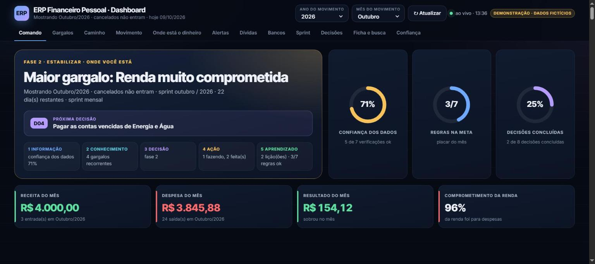

# ERP Financeiro Pessoal — Dashboard Estratégico

> Sistema de gestão financeira pessoal que transforma lançamentos do dia a dia em **diagnóstico, prioridades e decisões**: do dado bruto ao plano de ação.

## Acesse

| | |
|---|---|
| **Demonstração ao vivo** | [luiscarlossoarespro-cyber.github.io/erp-financeiro-pessoal](https://luiscarlossoarespro-cyber.github.io/erp-financeiro-pessoal/) |
| **Versão 1 do painel** | [dashboard.html](dashboard.html) · [vídeo da v1](demo.mp4) |

> **Privacidade:** a demonstração usa **dados 100% fictícios**. Nenhum dado financeiro real e nenhum identificador de planilha estão neste repositório.

---

## 1. Problema de negócio

Controlar finanças em planilha costuma parar no "quanto entrou e quanto saiu". O problema real é outro: **saber onde está o gargalo, o que fazer primeiro e se as decisões estão funcionando**. Sem isso, os mesmos erros se repetem todo mês: contas atrasadas, tarifas, gastos por impulso e dívidas sem acordo.

## 2. Perguntas que o projeto responde

- Qual é o **maior gargalo** das minhas finanças agora, e qual decisão ataca ele?
- Em que **fase** estou (estancar a perda → estabilizar → construir patrimônio) e quais metas faltam?
- Para onde foi o dinheiro no mês, e **onde dá para cortar**?
- Quais contas estão **vencidas**, quais tiveram **aumento fora do normal** e quais parecem **lançadas em duplicidade**?
- Quanto devo, **para quem** e em que situação?
- Quanto cada **banco** movimentou e **quanto cobrou** em tarifas e juros?
- O que se **repetiu nos últimos 3 meses**, quanto isso custou e as regras do mês estão sendo cumpridas?

## 3. Dados

- **Fonte:** planilha Google Sheets com 3 cadastros (Receitas, Despesas e Dívidas), lançados manualmente no dia a dia.
- **Camada analítica:** duas abas de gestão (*Gestão Estratégica* e *Decisões · Sprint*) calculam tudo com fórmulas: o dashboard **só lê**, não recalcula (fonte única da verdade).
- **Regras de qualidade:** 7 verificações automáticas (campos vazios, vencidos, duplicidades) geram um índice de **confiança dos dados**.

## 4. Ferramentas

| Camada | Ferramenta |
|---|---|
| Modelagem e cálculo | Google Sheets (`LET`, `ARRAYFORMULA`, `FILTER`, `MAP/LAMBDA`, `QUERY`), validação de dados, intervalos nomeados |
| Visualização | HTML, CSS e JavaScript puro · gráficos desenhados em SVG, sem bibliotecas |
| Desenvolvimento | Construído com apoio de IA generativa (Claude) a partir das regras e indicadores que eu defini |
| Métodos | Conceitos de **SAP MM** (MM03, MMBE, ME51N, ME2L) e de **gestão ágil** (sprint, backlog, kanban, retrospectiva) adaptados às finanças pessoais |

## 5. Solução

O dashboard é dividido em 12 blocos, na ordem em que uma decisão é tomada:

1. **Centro de comando:** fase atual, maior gargalo, próxima decisão e os 5 passos do ciclo da decisão (informação → conhecimento → decisão → ação → aprendizado).
2. **Gargalos:** ranking do mais grave ao menos grave, com índice de gravidade e decisão ligada.
3. **Caminho estratégico:** 3 fases com metas mensuráveis.
4. **Movimento do dinheiro:** gráfico anual (realizado x previsto), fluxo diário com saldo projetado e calendário interativo.
5. **Onde está o dinheiro:** categorias, maiores lançamentos, recorrências e onde cortar.
6. **Alertas:** auditoria de contas (vencidas, aumentos, sem valor, duplicidades) e pendências por fornecedor.
7. **Dívidas:** saldo por credor, por situação e próximos vencimentos.
8. **Bancos:** movimento e custo de cada conta.
9. **Sprint do mês:** retrospectiva de 3 meses, custo dos "buracos", placar das regras, indicadores meta x real e simulador de cenários.
10. **Decisões:** backlog gerado pelos dados + quadro kanban + registro de aprendizado + calibragem (o usuário ensina o que é ou não é gargalo).
11. **Ficha e busca:** tudo sobre um item (total pago, média, último pagamento, próximo vencimento) em uma busca.
12. **Confiança dos dados:** as verificações de qualidade.

**Experiência:** números contam do zero até o valor, barras crescem e blocos entram em sequência ao rolar a página ou trocar o filtro.

## 6. Principais resultados

- O controle deixa de ser só "olhar o saldo" e vira uma **rotina de decisão mensal**: cada gargalo gera uma decisão com valor em jogo, prioridade e status.
- A auditoria automática aponta **contas vencidas, aumentos fora do padrão e lançamentos duplicados** sem conferência manual.
- O **custo de cada banco** deixa visível quanto tarifas e juros pesam no mês, e esse gargalo entra no backlog como decisão.

## 7. Como usar

- **Ver a demonstração:** abra o link da demonstração ao vivo (funciona em qualquer navegador).
- **Navegar:** use as abas do topo; o filtro de **Ano e Mês** remonta a parte de movimento; a **busca** aceita descrição, categoria, fornecedor ou banco.

## 8. Aprendizados e próximos passos

- **Aprendi:** modelar uma base financeira com fonte única da verdade, definir KPIs que levam a decisão (e não só a relatório) e transformar regras de negócio em especificação para desenvolvimento com IA.
- **Próximos passos:** saldo real por conta (saldo inicial + movimento), metas anuais e versão em Power BI.

---

## Autor

**Luis Carlos Machado Soares** · 19 anos em logística e operações, em transição para Análise de Dados
[LinkedIn](https://www.linkedin.com/in/luiscarlos-log) · [Portfólio](https://luiscarlossoarespro-cyber.github.io/)
